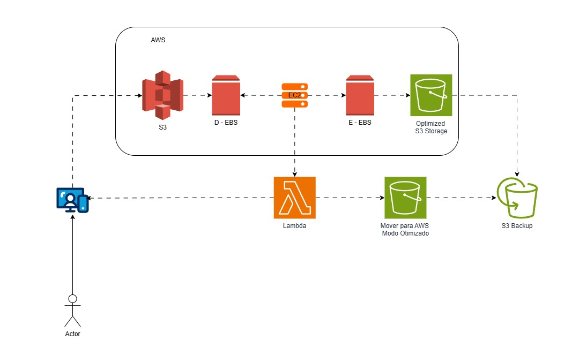

# 🏗️ Arquitetura do Projeto: Desafio DIO - Arquitetura AWS

Arquitetura relacionado a armazenamento de arquivos usando S3 e S3 Otimizado para melhorar o fluxo e diminuir custo, alem de backup de arquivos.

## 🗺️ Diagrama de Arquitetura

Aqui exibimos como os serviços da AWS se conectam para entregar a solução.

*(Escolha uma das opções abaixo para inserir seu diagrama)*

### Opção 1: Imagem (PNG/JPG/SVG)

## 🛠️ Serviços AWS Utilizados

*   **[Amazon EC2](https://amazon.com):** Servidores virtuais para hospedar a aplicação principal.
*   **[Amazon EBS](https://amazon.com):** Serviço de armazenamento em Bloco.
*   **[Amazon S3](https://amazon.com):** Serviço de armazenamento de objetos na nuvem.
*   **[Amazon Lambda](https://amazon.com):** Serviço de computação em nuvem (AWS) serverless.

## 🔍 Fluxo de Dados

1. Upload de arquivos: O ator envia arquivos para o **bucket S3**, que funciona como ponto central de ingestão.
2. Processamento inicial: Os arquivos podem ser manipulados em instâncias **EC2** conectadas a volumes **EBS**, caso seja necessário processamento temporário.
3. Armazenamento otimizado: Após o processamento, os arquivos são movidos para o bucket Optimized **S3** Storage, garantindo acesso rápido e eficiente.
4. Automação com Lambda: Funções **Lambda** automatizam a movimentação de arquivos entre buckets e podem aplicar regras de negócio ou triggers adicionais.
5. Backup dedicado: Snapshots dos volumes **EBS** e backups automáticos do banco RDS (se mantido) são enviados para o bucket Backup S3, garantindo resiliência e recuperação.

---
Criado com ☁️ por [Fernando S Cardoso/https://github.com/souzanandodev/]
